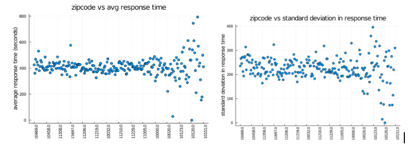
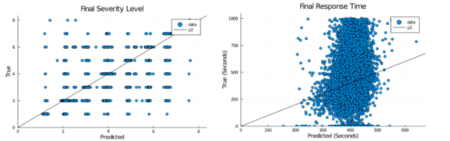
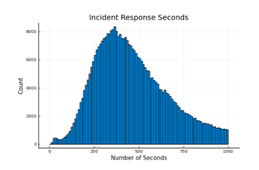
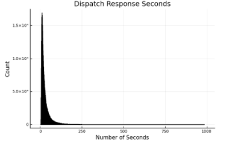

### 911 Calls New York Midterm Report

_Richard Zheng (rz98), Iris Li (icl5), Peter Gribizis (pjg222)_

### Problem Statement

Emergency medical services are a cornerstone of public health and safety in urban cities, saving countless lives a day. Cities, such as NYC, receive a large volume of daily 911 calls, averaging around 4,000 calls on any given day. Insights derived from these calls could have a direct impact on an individuals wellbeing, as oftentimes 911 dispatch has to deal with life threatening situations. 

The current Covid pandemic has made the necessity of 911 call analyses more apparent, as the daily call volume has spiked 40%, and emergency medical services are responding to fewer incidents in person. The question then is, can we predict the severity of a given call in the NYC area based on factors such as location metrics, time of day, season, etc. as well as the time it would take to get to an individual in need based on that severity level? The answer to this question, we hope, will provide valuable insights to dispatch operators and how they allocate resources to possibly ambiguous emergency calls that go through. 

### Dataset

For our project, we are relying on the [EMS Dispatch Data](https://data.cityofnewyork.us/Public-Safety/EMS-Incident-Dispatch-Data/76xm-jjuj) from NYC.  

This dataset has 20 million EMS call entries as recorded by the EMS Computer Aided Dispatch System from 2008 to present. The 31 features include initial and final call types with time stamps, initial and final severity level codes, dispatch and incident response times, location information like zip codes and districts, and dispatch location.

On data from 2019, around 8.25% of samples had unknown initial call types, and 6.8% had unknown final call types. The data also had two features that indicated whether the calculation of the dispatch response time and incident response times were valid. We dropped the samples that were labeled as invalid. 

### Initial Exploration and Feature Selection

From our initial dataset, we dropped several redundant columns that were simply calculated from operations on other columns. We identified the incident datetime (when the incident was first reported) as an important feature, since by extracting the month, week, day, and hour of the date we could hopefully capture how seasonality or time of day affects call severity or resolution time.  We also investigated how location data like zipcode and various district types could be reasonable features, but we found that the location metrics all functioned similarly in performance, so we chose to keep zip code in our final model while ignoring other location features. Lastly, we included features we believed will help capture the distribution of call urgency, such as the initial call type (what kind of injury the call reported), the initial severity level code (from 1-8, 8 being the highest priority severity), the time in seconds to assign a unit to handle the incident, etc. 

Our initial outputs consisted of the time from when the incident was first reported to the time units arrived on the scene and the final severity level code. We also considered modeling the final call type (which in some cases had changed from the initial call type) as an output, but we observed that about 89% of initial call types matched final call types, so we left it out of our consideration in our initial explorations. 

We created some visualizations to identify potential outliers. Since we expected zipcode to be an important feature, we plotted it against the average and standard deviation to look for outliers after preprocessing. It appears that there are a few outliers, but most of the zipcodes have relatively similar average response times, since dispatch locations are already fairly optimized.

### Data Analysis

We developed models focused on 2 main statistics: the final severity level code and the incident response seconds.  We tried to predict these 2 variables in particular since we wanted to find a way to measure how much EMS resources it takes to deal with calls.  We felt that the severity level and the incident response time were the best measures for how long and troublesome a call will take. 

To best capture the final severity level and incident response time, we initially used a least squares linear approximator with an 80/20 split.  Our model fairly accurately captured final severity level but struggled to fit incident response time.

We also tested the accuracy of tree based algorithms, namely SciKitLearn’s decision tree and random forest regressors.  We found that the decision trees did not perform as well on our dataset as compared to the least squares approach. 

|   	   Model Mean Squared Errors                     |
|	|  Least Squares 	| Decision Tree  	|   Random Forest	|
|---	                        |---	|---	|---	|---	|
|Final Severity Level   	    |   0.72757	| 0.77546 	|   0.74934	|
|   Incident Response Seconds	|  238.64   |   254.61	|   244.89	|   	|

### Plan for Future Work

Our initial analysis based on the first few models put together seemed to be underfitting the input data and yielding inaccurate predictions to our output space. We have made the assumption that the features we were initially trying to model were “too messy” in that there does not seem to be a linear correlation between our predictors and final severity level code/incident response seconds. A histogram of incident response seconds (the difference in time from when a dispatch call is taken to when emergency services arrive on site) shows that the distribution is slightly right-skewed with most times falling around the average of 461 seconds.

We want to see now if we can predict whether a given call will take more than the average of incident response seconds (specifically more than the third quartile), given the same feature space so that given an initial severity level, dispatch operators can know where more resources are needed for a certain call. We thought to explore how long it took for a dispatch operator to handle a call/situation, but as you can see from the histogram below, there is very little variability in that data. 

Additionally, we decided to drop the initial severity level from our output space as when you compare histograms of the initial and final severity levels, they look basically identical. 

We will continue testing other models (quantile regression, regression tree, nearest neighbors, etc.) to see if we can find a better fitting model to data that falls in the upper quartile of incident response seconds to predict which callers will end up taking a longer period of time to reach. Using a full calendar year of data (2019) should help us avoid underfitting, as well as having 400,000+ data points to fit, and seeing as we have data from 2008, we can check other past years to see if our model is overfitting to 2019. 

